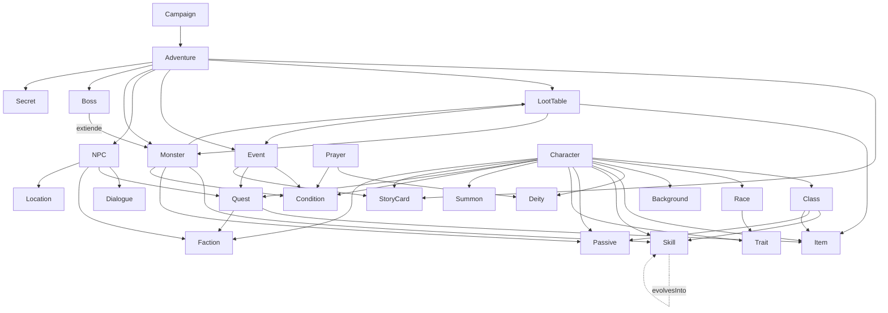

# Arquitectura de Datos — Onegai RPG

*Extiende `docs/Sistema_Cartas_Tiers.md` (secciones 9 y 13) al universo completo del juego: bestiario, NPCs, jefes, eventos, campañas, aventuras, loot, plegarias, facciones y narrativa. No redefine lo que el GDD ya cubre (Clase, Raza, Trasfondo, Habilidad, Hechizo, Pasiva, Equipo, Consumible, Rasgo, Invocación, Deidad): lo reutiliza tal cual y construye encima con las mismas convenciones — stats CON/DES/INT/CAR, tiers 0-5, `mechanicTags`, pool de d6 (sección 7), pilas de recursos (sección 6).*

---

## Índice

0. [Resumen de decisiones](#0-resumen-de-decisiones)
1. [Principios de arquitectura](#1-principios-de-arquitectura)
2. [Definiciones vs Instancias](#2-definiciones-vs-instancias)
3. [Esquema base común](#3-esquema-base-común)
4. [Estructura de carpetas](#4-estructura-de-carpetas)
5. [Esquemas por entidad](#5-esquemas-por-entidad)
6. [Relaciones entre entidades](#6-relaciones-entre-entidades)
7. [Diagrama de dependencias](#7-diagrama-de-dependencias)
8. [Ejemplos completos](#8-ejemplos-completos)
9. [Buenas prácticas](#9-buenas-prácticas)
10. [Compatibilidad con motores y bases de datos](#10-compatibilidad-con-motores-y-bases-de-datos)
11. [Ampliaciones futuras](#11-ampliaciones-futuras)
12. [Justificación técnica](#12-justificación-técnica)

---

## 0. Resumen de decisiones

**Contexto.** Onegai RPG necesita representar personajes, clases, razas, objetos, monstruos, NPCs, eventos, campañas y narrativa como el mismo tipo de objeto — una carta — y reutilizar ese formato en mesa, app móvil, editor, VTT, API y videojuego, sin duplicar datos entre esos contextos.

**Decisión.** Modelo **Data-Driven** con separación estricta entre **Definiciones** (catálogo, una única fuente de verdad por `id`) e **Instancias** (uso concreto en una partida, que referencia definiciones por `id` y nunca las copia). Toda relación entre entidades se expresa como referencia de ID, nunca como objeto embebido.

**Alternativas descartadas:**

| Alternativa | Por qué no |
|---|---|
| Embeber datos completos en cada instancia (p. ej. el personaje copia el JSON entero del arma que lleva) | Duplica datos, desincroniza al balancear una carta: habría que recorrer todos los personajes guardados para aplicar un cambio. |
| Un esquema único gigante con campos opcionales para todo tipo de entidad | Rompe ISP (secc. 1): un Monstruo arrastraría campos de Plegaria, Diálogo, etc. sin usarlos nunca; imposible de validar con un schema estricto. |
| Grafo de nodos tipados genérico (todo es un nodo con propiedades arbitrarias) | Sobra para el alcance actual: pierde la capacidad de generar formularios/plantillas específicas por tipo (como ya hace el GDD en su sección 9) y dificulta la validación. |

**Consecuencias.** El motor de resolución (mesa, app o videojuego) debe resolver referencias en tiempo de carga o bajo demanda; cualquier herramienta de autoría debe validar que los IDs referenciados existen antes de guardar.

---

## 1. Principios de arquitectura

Mapeo directo a SOLID, aplicado a datos en vez de a clases de código:

- **SRP (responsabilidad única).** Cada tipo de entidad tiene un único esquema y una única carpeta. Un Monstruo no sabe nada de Diálogo; un Diálogo no sabe nada de Loot.
- **OCP (abierto/cerrado).** Se extiende añadiendo `tags` nuevos o campos opcionales, nunca modificando el shape base de un tipo existente. Una carta de la edición 3 sigue siendo válida para un lector de la edición 2 si solo le añadió campos opcionales.
- **LSP (sustitución).** Todo tipo comparte el esquema base de la sección 3 (`id`, `type`, `name`, `tier`, `tags`...). Cualquier consumidor genérico ("lista todas las cartas de tier 2", "busca por tag") funciona sobre cualquier entidad sin conocer su subtipo.
- **ISP (segregación de interfaces).** Los subtipos de Objeto (arma, armadura, consumible...) añaden solo los campos que necesitan. Jefe extiende Monstruo añadiendo campos, no obliga a un Monstruo normal a cargar con `phases` vacío.
- **DIP (inversión de dependencias).** Las instancias dependen de una referencia abstracta (`id` + `type`), no de la estructura interna de la definición. Se puede reescribir por completo el motor de combate sin tocar un solo archivo de datos, y viceversa.

---

## 2. Definiciones vs Instancias

**Definición** = catálogo, existe una única vez, es lo que ya construye el GDD en su sección 9 (Clase, Habilidad, Equipo...) y lo que este documento añade (Monstruo, Evento, Aventura...). Vive en `/cards`, `/bestiary`, `/npcs`, etc.

**Instancia** = uso concreto durante una partida. Solo el **Personaje** y los estados transitorios de una invocación activa son instancias en este sistema; todo lo demás (Monstruo, NPC, Evento, Loot) es catálogo que se referencia, no se copia, incluso cuando aparece "en juego" (un monstruo colocado en un encuentro sigue siendo el mismo `monster_id`, con como mucho un `currentHealth` de sesión que vive en el estado transitorio de combate, no en el archivo de definición).

```json
// Definición (una sola vez, en /cards/equipment/item_reinforced_shield.json)
{ "id": "item_reinforced_shield", "name": "Escudo Reforzado", "type": "equipment", "slot": "arma_secundaria", "statBonuses": { "health": 2 } }

// Instancia (dentro de /characters/pj_kaelen.json — solo la referencia)
{ "id": "pj_kaelen", "name": "Kaelen", "equippedItems": { "arma_secundaria": "item_reinforced_shield" } }
```

Modificar el escudo en su único archivo actualiza automáticamente a todos los personajes que lo llevan equipado, en mesa o en base de datos, sin tocar `pj_kaelen.json`.

---

## 3. Esquema base común

Generaliza el mínimo que la sección 9 del GDD ya exige a toda carta jugable, extendido a **toda** entidad del universo (incluidas las que el jugador nunca ve directamente, como Aventura o Facción):

```json
{
  "id": "string (obl., snake_case, único global, con prefijo de tipo: skill_, monster_, npc_...)",
  "type": "string (obl., discriminador: class | race | background | skill | spell | passive | equipment | consumable | trait | summon | deity | monster | npc | boss | event | story | loot_table | prayer | condition | faction | dialogue | campaign | adventure | quest | location)",
  "name": "string (obl.)",
  "description": "string",
  "tier": "number (0-5, u obl. como rango [min,max] en Campaña/Aventura)",
  "rarity": "common | uncommon | rare | epic | mythic (opcional, no aplica a todos los tipos)",
  "tags": ["string"],
  "flavorText": "string (opcional)"
}
```

Cada tipo añade sus propios campos (sección 5). Un lector que solo conoce este esquema base (un buscador, un índice, un importador genérico) puede listar, filtrar por `tier`/`tags` y mostrar `name`/`description` de **cualquier** entidad del juego sin conocer su subtipo — la misma ventaja que ya usa el índice de `/cards/index.json` de la sección 13 del GDD, ahora aplicada a todo el proyecto.

---

## 4. Estructura de carpetas

Extiende la estructura ya definida en la sección 13 del GDD:

```
/cards                          (ya existe — GDD sección 13)
  /classes/{class_id}.json
  /races/{race_id}.json
  /backgrounds/{background_id}.json
  /skills/{skill_id}.json
  /spells/{spell_id}.json
  /passives/{passive_id}.json
  /equipment/{item_id}.json
  /consumables/{item_id}.json
  /traits/{trait_id}.json
  /summons/{summon_id}.json
  /deities/{deity_id}.json

/bestiary                       (nuevo)
  /monsters/{monster_id}.json
  /bosses/{boss_id}.json

/npcs/{npc_id}.json             (nuevo)
/dialogues/{dialogue_id}.json   (nuevo)
/factions/{faction_id}.json     (nuevo)

/narrative                      (nuevo)
  /story_cards/{story_id}.json
  /secrets/{secret_id}.json
  /events/{event_id}.json

/loot_tables/{loot_table_id}.json   (nuevo)
/prayers/{prayer_id}.json           (nuevo)
/conditions/{condition_id}.json     (nuevo — unifica Estado/Bendición/Maldición)

/world
  /locations/{location_id}.json     (nuevo)
  /quests/{quest_id}.json           (nuevo)
  /adventures/{adventure_id}.json   (nuevo)
  /campaigns/{campaign_id}.json     (nuevo)

/characters/{character_id}.json     (ya existe — instancias)

/rules                              (ya existe, + nuevos archivos)
  /tiers.json
  /piles.json
  /tags.json
  /compatibility_symbols.json
  /dice.json                        (nuevo — pool de d6, tabla de dificultades, sección 7 del GDD)
  /status_effects.json              (nuevo — catálogo cruzado de condiciones aplicables)
```

Cada carpeta puede llevar su propio `index.json` con los campos mínimos del esquema base (sección 3) para carga rápida sin parsear cada archivo — mismo patrón ya validado en `/cards/index.json`.

---

## 5. Esquemas por entidad

### 5.1 Entidades ya definidas (reutilizadas sin cambios)

Clase (9.1), Raza (9.2), Trasfondo (9.3), Pasiva (9.4), Habilidad (9.5), Hechizo (9.6), Equipo (9.7), Consumible (9.8), Rasgo Especial (9.9), Invocación (9.10), Deidad/Afinidad (9.11) — ver `docs/Sistema_Cartas_Tiers.md`. Se referencian por `id` desde las entidades nuevas de este documento (p. ej. un Monstruo reutiliza `skill_id`s existentes para sus ataques; una Deidad ya existente es la que reciben las Plegarias nuevas).

### 5.2 Personaje (instancia)

Único punto donde vive el estado concreto de una partida. No duplica ningún dato de sus referencias.

```json
{
  "id": "string (obl.)",
  "type": "character",
  "name": "string (obl.)",
  "tier": "number (0-5, obl.)",
  "classId": "class_id (obl.)",
  "secondClassId": "class_id (opcional, solo si Multiclase, ver GDD 11.1)",
  "raceId": "race_id (obl.)",
  "backgroundId": "background_id (obl.)",
  "deityId": "deity_id (opcional)",
  "baseStats": { "CON": 0, "DES": 0, "INT": 0, "CAR": 0 },
  "equippedItems": {
    "cabeza": "item_id | null", "torso": "item_id | null", "piernas": "item_id | null",
    "pies": "item_id | null", "arma_principal": "item_id | null", "arma_secundaria": "item_id | null"
  },
  "inventory": {
    "consumables": [{ "itemId": "consumable_id", "quantity": 1 }],
    "materials": [{ "itemId": "material_id", "quantity": 1 }]
  },
  "learnedCards": ["skill_id | spell_id", "..."],
  "resourcePiles": {
    "activa": ["skill_id", "..."],
    "descansoCorto": ["skill_id", "..."],
    "descansoLargo": ["skill_id", "..."]
  },
  "passiveId": "passive_id (obl., de la clase — nunca se elige)",
  "traits": ["trait_id", "..."],
  "activeSummons": [{ "summonId": "summon_id", "currentHealth": 0 }],
  "statuses": [{ "conditionId": "condition_id", "source": "string", "remainingDuration": "string|number" }],
  "questLog": [{ "questId": "quest_id", "status": "activa | completada | fallida", "objectivesDone": ["objective_id"] }],
  "storyCardsCollected": ["story_id", "..."],
  "factionReputation": { "faction_id": 0 },
  "gold": 0,
  "milestones": ["string (hitos narrativos que marcan progresión de tier, no XP acumulada — ver GDD sección 3)"]
}
```

Nada de esto calcula vida/CA/defensas: esos valores salen en el momento de la fórmula de la sección 5 del GDD a partir de `baseStats` + bonos de `equippedItems`/`traits`/`raceId` + `tier`. No se persisten como campo del personaje salvo como caché opcional de solo lectura.

### 5.3 Monstruo (definición)

```json
{
  "id": "string (obl.)",
  "type": "monster",
  "name": "string (obl.)",
  "description": "string",
  "tier": "number (obl.)",
  "monsterType": "bestia | no_muerto | aberracion | elemental | humanoide | espiritu | construccion",
  "role": "tank | striker | support | controller | swarm",
  "stats": { "CON": 0, "DES": 0, "INT": 0, "CAR": 0 },
  "health": "number (obl., sigue la misma lógica de la fórmula de vida del GDD sección 5, precalculada)",
  "armorClass": "number", "mentalDefense": "number", "physicalResistance": "number",
  "movement": "number",
  "ai": { "behavior": "agresivo | defensivo | huidizo | en_grupo", "priority": "string" },
  "skills": ["skill_id", "..."],
  "passives": ["passive_id", "..."],
  "resistances": ["tag"], "weaknesses": ["tag"], "immuneConditions": ["condition_id"],
  "lootTableId": "loot_table_id",
  "xpAwarded": "number (o equivalente de hito narrativo si la mesa no usa XP)",
  "tags": ["tag"]
}
```

### 5.4 NPC (definición)

```json
{
  "id": "string (obl.)", "type": "npc", "name": "string (obl.)", "description": "string", "tier": "number",
  "role": "comerciante | informador | dador_de_mision | aliado | rival | figura_social",
  "stats": { "CON": 0, "DES": 0, "INT": 0, "CAR": 0 },
  "dialogueId": "dialogue_id (opcional)",
  "shopInventory": [{ "itemId": "item_id", "price": 0, "stock": -1 }],
  "questsOffered": ["quest_id"],
  "relationships": [{ "npcId": "npc_id", "type": "aliado | rival | familia | mentor" }],
  "factionId": "faction_id (opcional)",
  "locationId": "location_id (opcional, dónde se encuentra por defecto)"
}
```

### 5.5 Jefe (extiende Monstruo)

```json
{
  "id": "string (obl.)", "type": "boss", "extendsMonster": "monster_id | null (si reutiliza una base)",
  "name": "string (obl.)", "description": "string", "tier": "number (obl.)",
  "monsterType": "...", "role": "...", "stats": { }, "health": 0, "armorClass": 0,
  "mentalDefense": 0, "physicalResistance": 0, "movement": 0,
  "phases": [{
    "id": "string", "healthThreshold": "0.0-1.0 (fracción de vida que activa la fase)",
    "aiOverride": "string (opcional)", "newSkills": ["skill_id"], "newPassives": ["passive_id"]
  }],
  "specialMechanics": ["string"],
  "summonsOnPhase": [{ "phaseId": "string", "summonId": "summon_id", "quantity": 1 }],
  "triggersEvents": ["event_id"],
  "uniqueLootTableId": "loot_table_id (garantizado, distinto del loot normal del tipo de monstruo)",
  "tags": ["tag"]
}
```

### 5.6 Evento (definición)

```json
{
  "id": "string (obl.)", "type": "event", "name": "string (obl.)", "description": "string", "tier": "number",
  "trigger": { "type": "ubicacion | dialogo | objeto | combate | tiempo", "condition": "string" },
  "effects": [{ "description": "string" }],
  "playerOptions": [{
    "id": "string", "text": "string",
    "requirements": { "stat": "CON|DES|INT|CAR", "minValue": 0, "itemId": "item_id" },
    "consequences": { "grantsItem": "item_id", "appliesCondition": "condition_id", "startsQuest": "quest_id" }
  }],
  "continuesTo": "event_id | story_id | null",
  "oneTime": true
}
```

### 5.7 Carta de Historia (definición)

```json
{
  "id": "string (obl.)", "type": "story", "name": "string (obl.)", "description": "string", "tier": "number",
  "references": { "npcId": "npc_id", "locationId": "location_id", "eventId": "event_id", "dialogueId": "dialogue_id", "secretId": "secret_id" },
  "decision": { "description": "string", "options": ["string"] },
  "endingId": "string (opcional, si esta carta resuelve un final de aventura)",
  "discardable": true,
  "unlocks": ["card_id | quest_id | event_id"]
}
```

### 5.8 Secreto (definición)

```json
{
  "id": "string (obl.)", "type": "secret", "name": "string (obl.)", "description": "string", "tier": "number",
  "discoveryCondition": "string (ej. 'superar CD 1.5 de INT en la biblioteca')",
  "revealsCardId": "story_id | event_id",
  "rewardId": "item_id | quest_id | null"
}
```

### 5.9 Diálogo (definición)

```json
{
  "id": "string (obl.)", "type": "dialogue", "name": "string (obl.)",
  "startNodeId": "string (obl.)",
  "nodes": [{
    "id": "string (obl.)", "speaker": "npc_id | player",
    "text": "string (obl.)",
    "options": [{
      "text": "string", "nextNodeId": "string | null (null cierra el diálogo)",
      "requirements": { "factionReputation": { "faction_id": 0 }, "questStatus": { "quest_id": "completada" } },
      "effects": { "startsQuest": "quest_id", "grantsItem": "item_id", "changesReputation": { "faction_id": 0 } }
    }]
  }]
}
```

### 5.10 Loot (mesa de botín)

```json
{
  "id": "string (obl.)", "type": "loot_table", "name": "string (obl.)", "tier": "number",
  "entries": [{
    "entryType": "objeto | oro | trampa | enemigo | evento | llave | material | artefacto",
    "refId": "item_id | monster_id | event_id | material_id (según entryType)",
    "goldRange": [0, 0],
    "trapEffect": "string (solo si entryType = trampa)",
    "weight": "number (peso relativo de aparición)"
  }],
  "rollCount": "number | { min, max } (cuántas entradas se resuelven por apertura)"
}
```

Cada aventura referencia sus propias `loot_table_id`s (mazo de loot propio de la sección "Aventura", 5.15) en vez de duplicar entradas entre aventuras.

### 5.11 Plegaria (definición)

```json
{
  "id": "string (obl.)", "type": "prayer", "name": "string (obl.)", "tier": "number",
  "deityId": "deity_id (obl.)",
  "requirement": { "minFavor": 0, "minCAR": 0, "condition": "string (opcional, ej. 'en un santuario del dios')" },
  "favorCost": "number",
  "effectType": "blessing | curse",
  "conditionGranted": "condition_id (referencia a 5.12)",
  "duration": "instant | 1_turn | 1_min | concentration | permanent"
}
```

### 5.12 Condición — unifica Estado, Bendición y Maldición

Las tres son mecánicamente lo mismo (un modificador temporal), solo cambia el origen y si es positivo o negativo — un único esquema evita triplicar lógica de aplicación/expiración.

```json
{
  "id": "string (obl.)", "type": "condition", "name": "string (obl.)",
  "category": "buff | debuff | neutro",
  "source": "estado | bendicion | maldicion",
  "stackable": false,
  "duration": "instant | 1_turn | 1_min | concentration | permanent | hasta_curarse",
  "effects": [{ "description": "string (obl.)", "mechanicHook": "string (referencia a qué tirada/fórmula modifica, ej. 'desventaja:ataque', 'resta_dado:CON')" }],
  "cureConditions": ["descanso_corto", "descanso_largo", "habilidad_curacion", "string libre"]
}
```

### 5.13 Facción (definición)

```json
{
  "id": "string (obl.)", "type": "faction", "name": "string (obl.)", "description": "string",
  "goal": "string", "leaderNpcId": "npc_id", "memberNpcIds": ["npc_id"],
  "reputationLevels": [{ "min": 0, "max": 0, "title": "string", "effects": "string" }],
  "relations": [{ "factionId": "faction_id", "standing": "aliada | neutral | hostil" }]
}
```

### 5.14 Localización (definición)

```json
{
  "id": "string (obl.)", "type": "location", "name": "string (obl.)", "description": "string", "tier": "number",
  "locationType": "ciudad | mazmorra | salvaje | santuario | ruina | campamento",
  "connectedLocations": ["location_id"],
  "npcsPresent": ["npc_id"],
  "availableAdventures": ["adventure_id"],
  "dangerLevel": "number"
}
```

### 5.15 Aventura (definición)

```json
{
  "id": "string (obl.)", "type": "adventure", "name": "string (obl.)", "description": "string",
  "recommendedTier": [0, 5],
  "storyDeck": ["story_id"],
  "lootTables": ["loot_table_id"],
  "eventDeck": ["event_id"],
  "npcs": ["npc_id"], "monsters": ["monster_id"], "bossId": "boss_id | null",
  "objectives": [{ "id": "string", "description": "string", "type": "principal | secundario" }],
  "secrets": ["secret_id"],
  "possibleEndings": [{ "id": "string", "condition": "string", "description": "string" }]
}
```

> **Actualización (jul 2026) — mazo por actos (GDD §20).** El `storyDeck` plano de `story_id`
> era una lista de ganchos sin estructura: no distinguía Acto, ni tipo de carta, ni requisitos
> de ficha, ni ramas de inyección. La implementación real (`model/CartaAventura.java` +
> `model/Aventura.java`) lo sustituye por un array **aditivo** `cartasHistoria`, de forma que
> una aventura sin él sigue siendo una aventura plana legacy válida (las 52 en `data/aventuras`).
> Cada Carta de Historia (esquema de generación en `Plantilla_Prompt_Contenido.md §18b`):
>
> ```json
> {
>   "code": "A1-03", "acto": 1, "titulo": "string",
>   "tipo": "base | condicional | inyectada | cadena | balance_final",
>   "cadena": { "orden": 1, "total": 3 },                       // solo cadena 🔗
>   "activacion": { "requiereCode": "A1-02", "estado": "verde | roja" }, // solo condicional, máx 1
>   "escena": "texto (cara jugador)",
>   "ramas": [{ "cuandoCode": "A1-02", "cuandoEstado": "roja", "texto": "…" }], // ≥2 en inyectada
>   "ganchoIgnorar": "línea 'Si ignoran esto…' (copia del Director)",
>   "referencias": { "npcIds": [], "enemigoIds": [], "localizacionId": null, "lootTableId": null, "storyId": null },
>   "balance": [{ "condicion": "≥3 rojas en Acto I", "epilogo": "…" }]          // solo balance_final
> }
> ```
>
> El modelo Java acepta también las claves inglesas del prompt (`act`, `title`, `cardKind`,
> `activation`/`requires`/`state`, `scene`, `branches`/`whenCode`/`whenState`/`text`,
> `ignoreHook`, `references`/`enemyIds`/`locationId`, `balanceTable`/`condition`/`epilogue`) vía
> `@JsonAlias`, para importar directo lo generado por §18b. Nuevos campos de galería en la
> aventura: `tema`, `estado` (`borrador|en_curso|completa`), `arquitectura`
> (`espina_de_pescado|facciones|crawler`). Plan completo: `Plan_Implementacion_Constructor_Aventuras.md`.

### 5.16 Misión / Encargo (definición)

```json
{
  "id": "string (obl.)", "type": "quest", "name": "string (obl.)", "description": "string", "tier": "number",
  "giverNpcId": "npc_id",
  "objectives": [{ "id": "string", "description": "string", "type": "principal | opcional", "targetRefId": "npc_id | monster_id | item_id | location_id" }],
  "rewards": { "gold": 0, "items": ["item_id"], "reputation": [{ "factionId": "faction_id", "delta": 0 }] }
}
```

### 5.17 Campaña (definición, agregador raíz)

```json
{
  "id": "string (obl.)", "type": "campaign", "name": "string (obl.)", "description": "string",
  "tierRange": [0, 5],
  "adventures": ["adventure_id"],
  "npcs": ["npc_id"], "factions": ["faction_id"], "locations": ["location_id"],
  "storyCards": ["story_id"], "globalEvents": ["event_id"],
  "rewards": ["item_id | trait_id"]
}
```

---

## 6. Relaciones entre entidades

Todas las relaciones se expresan con campos `*Id` (uno) o `*Ids`/array (muchos), nunca embebiendo el objeto referenciado:

| Entidad | Referencia a |
|---|---|
| Personaje | classId, raceId, backgroundId, deityId, equippedItems (item_id por slot), learnedCards (skill/spell_id), passiveId, traits, activeSummons (summon_id), statuses (condition_id), questLog (quest_id), storyCardsCollected (story_id), factionReputation (faction_id) |
| Monstruo / Jefe | skills, passives (skill_id/passive_id), lootTableId, immuneConditions (condition_id), summonsOnPhase (summon_id), triggersEvents (event_id) |
| NPC | dialogueId, questsOffered (quest_id), factionId, locationId |
| Evento | continuesTo (event_id/story_id), consequences (item_id/condition_id/quest_id) |
| Carta de Historia | references (npc/location/event/dialogue/secret), unlocks |
| Loot | entries.refId (item/monster/event/material_id) |
| Plegaria | deityId, conditionGranted (condition_id) |
| Facción | leaderNpcId, memberNpcIds, relations (faction_id) |
| Localización | connectedLocations, npcsPresent, availableAdventures (adventure_id) |
| Aventura | storyDeck, lootTables, eventDeck, npcs, monsters, bossId, secrets |
| Misión | giverNpcId, objectives.targetRefId, rewards.items |
| Campaña | adventures, npcs, factions, locations, storyCards, globalEvents |

---

## 7. Diagrama de dependencias



---

## 8. Ejemplos completos

### Personaje (fragmento)

```json
{
  "id": "pj_kaelen", "type": "character", "name": "Kaelen", "tier": 2,
  "classId": "class_wandering_blade", "raceId": "race_human_marches", "backgroundId": "bg_soldier",
  "baseStats": { "CON": 3, "DES": 4, "INT": 1, "CAR": 2 },
  "equippedItems": { "arma_principal": "item_longsword", "torso": "item_medium_armor", "arma_secundaria": "item_parry_bracer", "cabeza": null, "piernas": null, "pies": null },
  "learnedCards": ["skill_double_slash", "skill_flanking_step", "skill_interrupt_strike", "skill_combat_combo_t2"],
  "resourcePiles": { "activa": ["skill_double_slash", "skill_flanking_step"], "descansoCorto": ["skill_interrupt_strike"], "descansoLargo": [] },
  "passiveId": "passive_combat_instinct", "traits": [], "activeSummons": [], "statuses": [],
  "questLog": [{ "questId": "quest_missing_caravan", "status": "activa", "objectivesDone": ["obj_find_tracks"] }],
  "storyCardsCollected": ["story_regiment_debt_intro"], "factionReputation": { "faction_iron_watch": 12 }, "gold": 45
}
```

### Monstruo

```json
{
  "id": "monster_bog_stalker", "type": "monster", "name": "Acechador del Pantano", "tier": 2,
  "monsterType": "bestia", "role": "striker", "stats": { "CON": 3, "DES": 5, "INT": 1, "CAR": 1 },
  "health": 14, "armorClass": 13, "mentalDefense": 11, "physicalResistance": 13, "movement": 6,
  "ai": { "behavior": "agresivo", "priority": "objetivo con menos vida" },
  "skills": ["skill_venomous_bite", "skill_pounce"], "passives": ["passive_camouflage"],
  "resistances": ["Veneno"], "weaknesses": ["Fuego"], "immuneConditions": [],
  "lootTableId": "loot_swamp_common", "xpAwarded": 25, "tags": ["Pantano", "Nocturno"]
}
```

### Jefe (extiende Monstruo)

```json
{
  "id": "boss_marsh_tyrant", "type": "boss", "extendsMonster": "monster_bog_stalker",
  "name": "Tirano de la Ciénaga", "tier": 3, "health": 60, "armorClass": 15,
  "phases": [
    { "id": "fase_1", "healthThreshold": 1.0, "newSkills": ["skill_tail_sweep"] },
    { "id": "fase_2", "healthThreshold": 0.5, "aiOverride": "invoca refuerzos", "newSkills": ["skill_toxic_cloud"] }
  ],
  "specialMechanics": ["La niebla reduce el alcance visual a corto en fase 2"],
  "summonsOnPhase": [{ "phaseId": "fase_2", "summonId": "summon_swamp_leech", "quantity": 2 }],
  "triggersEvents": ["event_marsh_collapse"],
  "uniqueLootTableId": "loot_marsh_tyrant_unique", "tags": ["Jefe", "Pantano"]
}
```

### Evento

```json
{
  "id": "event_collapsing_bridge", "type": "event", "name": "El puente cede", "tier": 1,
  "trigger": { "type": "ubicacion", "condition": "cruzar el Puente Viejo" },
  "playerOptions": [
    { "id": "opt_jump", "text": "Saltar al otro lado", "requirements": { "stat": "DES", "minValue": 3 }, "consequences": { "appliesCondition": "condition_shaken" } },
    { "id": "opt_climb_down", "text": "Descender por el lateral", "requirements": {}, "consequences": {} }
  ],
  "continuesTo": "story_bridge_aftermath", "oneTime": true
}
```

### Loot

```json
{
  "id": "loot_swamp_common", "type": "loot_table", "name": "Botín del Pantano", "tier": 2,
  "entries": [
    { "entryType": "oro", "goldRange": [5, 15], "weight": 40 },
    { "entryType": "objeto", "refId": "item_venom_gland", "weight": 25 },
    { "entryType": "trampa", "trapEffect": "Nube de esporas: prueba de CON o queda Envenenado", "weight": 10 },
    { "entryType": "material", "refId": "material_bog_leather", "weight": 25 }
  ],
  "rollCount": { "min": 1, "max": 2 }
}
```

### Aventura (fragmento)

```json
{
  "id": "adventure_marsh_of_lost_names", "type": "adventure", "name": "El Pantano de los Nombres Perdidos",
  "recommendedTier": [2, 3], "storyDeck": ["story_regiment_debt_intro", "story_bridge_aftermath"],
  "lootTables": ["loot_swamp_common", "loot_marsh_tyrant_unique"], "eventDeck": ["event_collapsing_bridge"],
  "npcs": ["npc_hermit_yara"], "monsters": ["monster_bog_stalker"], "bossId": "boss_marsh_tyrant",
  "objectives": [{ "id": "obj_main", "description": "Encontrar la caravana desaparecida", "type": "principal" }],
  "secrets": ["secret_sunken_shrine"],
  "possibleEndings": [{ "id": "end_rescue", "condition": "objetivo principal completado antes del tier 4", "description": "La caravana se salva." }]
}
```

---

## 9. Buenas prácticas

Validar todo archivo contra un JSON Schema (o Zod/Ajv en el pipeline de build) antes de aceptarlo en el catálogo — igual que la sección 12 del GDD exige probar una carta en mesa antes de marcarla `common`. Mantener un `index.json` por carpeta con los campos del esquema base para listar sin parsear cada archivo. No borrar nunca un `id` ya publicado: si una entidad queda obsoleta, marcarla `"deprecated": true` con `"replacedBy": "nuevo_id"` en vez de eliminar el archivo, para no romper referencias históricas en partidas guardadas. Añadir un `schemaVersion` (o reutilizar el campo `edition` ya usado en el GDD) a `/rules` para que herramientas externas sepan qué forma esperar. Correr en CI un script de integridad referencial que recorra todo `*Id`/`*Ids` y confirme que el archivo referenciado existe — no hay claves foráneas reales en archivos planos, así que esta validación sustituye a la que daría una base de datos relacional. Mantener la convención de nombres `snake_case` con prefijo de tipo (`skill_`, `monster_`, `npc_`, `event_`, `loot_`, `prayer_`, `condition_`, `faction_`, `dialogue_`, `campaign_`, `adventure_`, `quest_`, `location_`, `story_`, `secret_`) para que un `id` sea autoexplicativo incluso fuera de contexto.

---

## 10. Compatibilidad con motores y bases de datos

**PostgreSQL.** Una tabla por tipo, columnas indexadas para `id`/`type`/`tier`, columna `JSONB` para los campos variables (`effect`, `phases`, `entries`...). Las relaciones `*Id` se implementan como columnas con FK real, recuperando la integridad referencial que los archivos planos no tienen.

**MongoDB / Firebase.** Una colección por carpeta; cada archivo JSON es un documento; `id` como `_id`/clave de documento. Encaja sin transformación.

**API REST.** `/api/v1/{tipo}/{id}` para lectura individual, `/api/v1/{tipo}?tier=&tag=` para listados filtrados sobre el esquema base común.

**GraphQL.** Cada tipo es un `type` con resolvers que resuelven los campos `*Id`/`*Ids` a sus objetos completos bajo demanda — el cliente pide solo lo que necesita, sin que el servidor tenga que anidar payloads completos por adelantado.

**Unity.** Los JSON se transforman en `ScriptableObject` en tiempo de build, o se cargan en runtime vía Addressables + Newtonsoft.Json, manteniendo `id` como clave de búsqueda en un diccionario central.

**Godot.** Recursos custom (`.tres`) generados desde JSON, o carga directa en runtime con un autoload que indexa por `id`; `class_name` por tipo replica el discriminador `type`.

**Unreal Engine.** `DataTable` importado desde JSON/CSV para catálogos planos, o `UPrimaryDataAsset` + Asset Manager cuando la entidad necesita carga bajo demanda (Aventuras, Campañas) en vez de cargarse entera en memoria.

En los seis casos el punto en común es el mismo: **el `id` es la clave universal de resolución**, así que ningún motor necesita conocer la estructura interna de una entidad para poder referenciarla.

---

## 11. Ampliaciones futuras

Localización (i18n): separar `name`/`description` a un archivo de strings por idioma indexado por `id`, sin tocar el resto del esquema. Crafting: nueva entidad `recipe` que referencia `material_id`s de entrada y un `item_id` de salida, reutilizando el mismo patrón de referencias. Generación procedural: construir `loot_table`/`eventDeck` de una Aventura por reglas (tier, bioma) en vez de a mano, sin cambiar el esquema de destino. Mod support: cargar carpetas externas (`/cards-mods/{mod_id}/...`) con el mismo schema y namespacing de `id` (`mod_nombre::id`) para evitar colisiones con el contenido base. Sesión de combate en vivo: entidad transitoria (ya prevista en el Bloque D del plan de implementación del proyecto) separada de los datos permanentes, que sostiene `currentHealth`, iniciativa activa y estados de la escena sin tocar las definiciones de Monstruo/Personaje. Colección vs mano activa: el modelo de mazo de la sección 3 del GDD (un personaje puede *poseer* más cartas de las que tiene *activas*) se extiende igual a NPCs con inventario de venta y a mesas de loot con más entradas de las que se resuelven por apertura.

---

## 12. Justificación técnica

Referenciar por `id` en vez de embeber es la misma normalización que separar tabla catálogo de tabla de transacciones en un modelo relacional: una única fuente de verdad, y actualizar una entidad actualiza automáticamente a todo lo que la referencia, sin recorrer datos derivados. Separar Definición de Instancia es el mismo patrón que clase vs. objeto, o receta vs. plato servido: el catálogo describe *qué es posible*, la instancia describe *qué existe ahora, en esta partida concreta*. El esquema base compartido (sección 3) es lo que permite construir herramienta genérica — un buscador, un validador, un importador CSV, un editor visual de cartas — sin que cada tipo nuevo obligue a reescribir esa herramienta. Y precisamente porque cada entidad es un archivo o documento independiente, añadir contenido nuevo (una clase, un monstruo, una aventura entera) nunca exige migrar ni tocar los datos ya publicados: el modelo escala a miles de cartas por la misma razón por la que escala a diez.
